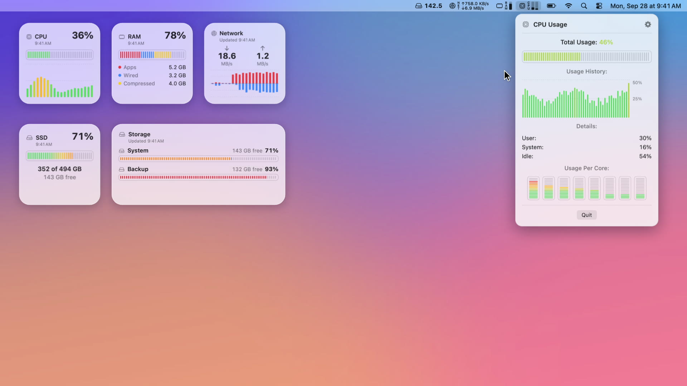
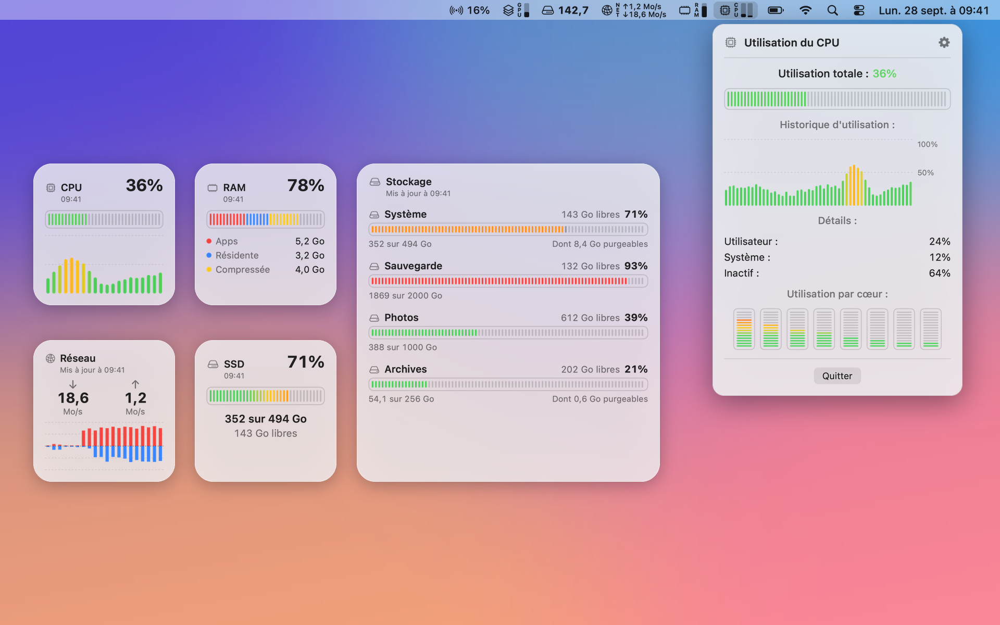
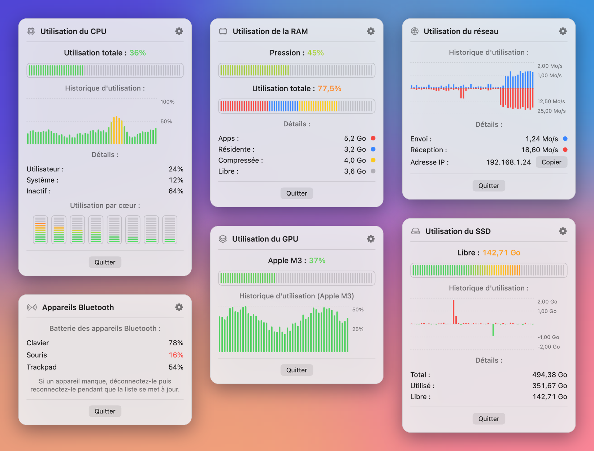
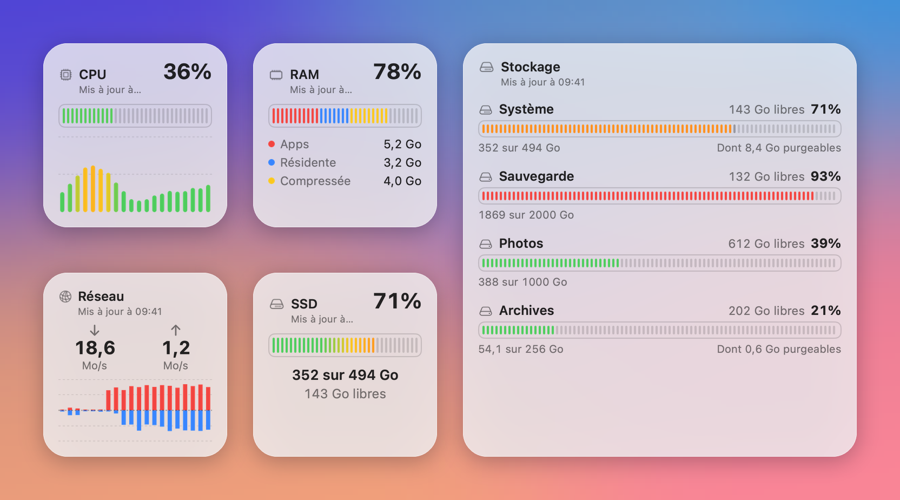

# SimplyBar

[English](README.md) | **Français**

[](https://github.com/Iliesseu28/SimplyBar/actions/workflows/ci.yml)
[](LICENSE)


[](docs/video/simplybar-promo.mp4)

La démonstration en vidéo : cliquez sur l'image pour lancer la vidéo de 29 secondes (en anglais).

Un moniteur système gratuit et open source pour la barre de menus de macOS. SimplyBar affiche d'un coup d'œil
le processeur, la mémoire, le réseau, le disque, la carte graphique et la batterie des appareils Bluetooth,
ouvre une fenêtre détaillée quand on clique sur un élément, et ajoute cinq widgets au bureau.



## Points forts

- **Gratuit, pour de bon.** Ni publicité, ni compte, ni abonnement, ni achat intégré. Licence MIT.
- **Open source.** Chaque ligne qui tourne sur votre Mac est dans ce dépôt.
- **Un widget Stockage pour tous les disques.** Un seul widget liste le disque de démarrage et tous les disques
  externes, en petite, moyenne et grande taille. On choisit dans ses réglages le disque qu'il montre en premier.
- **Respect de la vie privée.** L'app tourne dans le bac à sable de macOS, sans aucun accès au réseau. Rien n'est
  collecté, rien ne quitte votre Mac.
- **Légère.** Un module masqué n'est pas mesuré du tout. Swift et SwiftUI natifs, aucune dépendance tierce.

## Ce qu'elle affiche

### Barre de menus

Chaque module s'active ou se masque, et l'on choisit ce qu'il affiche et comment (barre, pourcentage ou
gigaoctets, selon le module).

| Module | Dans la barre de menus | Dans sa fenêtre détaillée |
|---|---|---|
| CPU | Total, utilisateur, système, inactif, utilisateur + système, ou une barre par cœur | Historique, parts utilisateur, système et inactif, utilisation par cœur |
| RAM | Total, apps, mémoire résidente, compressée, ou pression mémoire | Historique et détail complet de la mémoire utilisée |
| GPU | Utilisation de la carte graphique | Historique, avec le modèle de la puce graphique |
| Réseau | Envoi, réception, les deux, ou l'adresse IP locale | Débits d'envoi et de réception, historique, adresse IP locale (copiable d'un clic) |
| SSD | Espace total, libre ou utilisé du disque de démarrage | Historique de l'espace utilisé, puis espace total, utilisé et libre |
| Bluetooth | Batterie de vos appareils connectés | Tous les appareils connectés, avec leur batterie quand macOS la fournit |




### Widgets de bureau

| Widget | Tailles | Contenu |
|---|---|---|
| CPU | Petite | Charge du processeur et son historique récent |
| RAM | Petite | Mémoire utilisée et sa répartition : apps, résidente, compressée |
| Réseau | Petite | Débits de réception et d'envoi avec leur historique récent |
| SSD | Petite | Espace utilisé et libre du disque de démarrage |
| Stockage | Petite, moyenne, grande | Tous les disques, externes compris ; la petite taille montre le disque choisi |

Les widgets lisent les valeurs que l'app écrit dans son conteneur partagé (App Group) : laissez SimplyBar
tourner pour qu'ils se mettent à jour. WidgetKit les rafraîchit environ toutes les 30 minutes, et un widget
qu'on vient de poser peut attendre jusqu'à 5 minutes ses premiers chiffres. Chaque widget affiche l'heure de sa
dernière mesure.



## Limites connues

Elles viennent de macOS, pas d'une fonction oubliée :

- **Ni températures, ni vitesse des ventilateurs.** Les capteurs qui les donnent sont fermés aux apps du bac à
  sable, obligatoire pour toute app du Mac App Store.
- **Pas de niveau de batterie pour les casques et écouteurs sans fil.** macOS ne le donne pas aux apps du
  Mac App Store. Ils apparaissent quand même comme connectés dans la liste Bluetooth. Les claviers, souris et
  trackpads Apple, et les accessoires que macOS liste comme sources d'alimentation, affichent bien leur batterie.
- **L'espace libre est légèrement arrondi vers le bas.** Dans le bac à sable, macOS arrondit la capacité
  disponible d'un disque.

## Installation

- **Mac App Store :** bientôt disponible.
- **Depuis le code source :** voir plus bas. L'app tourne sur macOS 14 Sonoma ou plus récent (binaire universel
  pour Apple silicon et Intel). Sa compilation demande Xcode 26.6 ou plus récent : la CI vérifie chaque
  changement avec Xcode 26.6 et Xcode 27.

## Compiler et tester

Clonez le dépôt, puis lancez les tests depuis le dossier du projet. La signature est désactivée en ligne de
commande : ni compte développeur Apple, ni certificat ne sont nécessaires.

```sh
git clone https://github.com/Iliesseu28/SimplyBar.git
cd SimplyBar
xcodebuild test \
  -project SimplyBar.xcodeproj \
  -scheme SimplyBar \
  -destination 'platform=macOS' \
  CODE_SIGNING_ALLOWED=NO CODE_SIGNING_REQUIRED=NO CODE_SIGN_IDENTITY=""
```

La commande se termine par `** TEST SUCCEEDED **`. La même tourne dans la CI à chaque push et à chaque pull
request ([workflow](.github/workflows/ci.yml)).

Pour compiler l'app elle-même en Release, toujours sans signature :

```sh
xcodebuild build \
  -project SimplyBar.xcodeproj \
  -scheme SimplyBar \
  -configuration Release \
  -destination 'platform=macOS' \
  CODE_SIGNING_ALLOWED=NO CODE_SIGNING_REQUIRED=NO CODE_SIGN_IDENTITY=""
```

### La lancer sur votre Mac

La compilation sans signature prouve que le code compile. Pour lancer l'app avec ses widgets, signez-la avec
votre propre équipe :

1. Ouvrez `SimplyBar.xcodeproj` dans Xcode.
2. Dans **Signing & Capabilities**, choisissez votre équipe pour les cibles `SimplyBar` et `SimplyBarWidgets`.
3. L'identifiant de l'App Group commence par l'identifiant d'équipe. Remplacez `ZNPYGQCK98` par le vôtre dans
   `SimplyBar/SimplyBar.entitlements`, `SimplyBarWidgets/SimplyBarWidgets.entitlements` et
   `Shared/SharedStore.swift`. Ne commitez pas ce changement.
4. Lancez le schéma `SimplyBar`. L'app vit dans la barre de menus et n'a pas d'icône dans le Dock.

Si l'app, placée dans le bac à sable, se ferme juste après son lancement depuis un disque externe, copiez
`SimplyBar.app` dans `/Applications` et ouvrez-la depuis là.

## Architecture

| Dossier | Rôle | Cibles |
|---|---|---|
| `Shared/` | Modèles, formats des nombres, graphiques, fichier partagé avec les widgets, String Catalog | App, widgets, tests |
| `Core/` | Lectures système : CPU (`host_processor_info`), mémoire (`host_statistics64`), disque (`volumeAvailableCapacityForImportantUsage`), réseau (`getifaddrs`), GPU (IOKit `IOAccelerator`), Bluetooth (IOKit, sources d'alimentation, Core Audio), disques du widget Stockage (`getfsstat` et IOKit) | App, tests |
| `SimplyBar/` | L'app : réglages, minuteries de mesure, éléments de la barre de menus, fenêtres détaillées, fenêtre de réglages | App |
| `SimplyBarWidgets/` | Extension WidgetKit. Elle lit le fichier partagé et ne mesure rien elle-même | Widgets |
| `SimplyBarTests/` | Suites Swift Testing : formats, pourcentages, calculs CPU, mémoire, réseau et Bluetooth, lecteurs réels | Tests |

- Swift 6 en concurrence stricte : vues et état sur le main actor, lecteurs `nonisolated`.
- Aucun paquet tiers. Uniquement les frameworks du SDK de macOS.
- Un module ni affiché ni ouvert n'est pas mesuré. Un module qui n'alimente qu'un widget est mesuré une fois par minute.
- Les textes sont dans des String Catalogs (`Shared/Localizable.xcstrings`, `SimplyBar/InfoPlist.xcstrings`).

## Confidentialité

- **Aucune donnée collectée.** Ni statistiques d'usage, ni rapport de plantage, ni compte. Voir
  [la politique de confidentialité](https://simplibot.fr/simplybar/confidentialite).
- **Aucun accès au réseau.** L'app et ses widgets n'ont pas le droit d'accès au réseau : ils ne peuvent se
  connecter à rien. Le module Réseau compte seulement les octets de vos propres interfaces.
- **Bac à sable.** L'app et ses widgets partagent seulement un conteneur App Group sur votre Mac, qui sert à
  transmettre les dernières valeurs aux widgets. Les réglages restent dans les préférences de l'app.
- **Manifestes de confidentialité** (`PrivacyInfo.xcprivacy`) : aucun pistage, aucune donnée collectée.

## Liens

- Site : <https://simplibot.fr/simplybar>
- Politique de confidentialité : <https://simplibot.fr/simplybar/confidentialite>
- Assistance : <https://simplibot.fr/simplybar/support>

## Contribuer

Signalements de bugs, idées et pull requests sont les bienvenus. Lisez d'abord [CONTRIBUTING.md](CONTRIBUTING.md)
(en anglais) : le bac à sable, l'absence d'accès au réseau et l'absence de dépendance tierce sont des règles
fermes. Pour signaler une faille de sécurité en privé, voir [SECURITY.md](SECURITY.md).

## Licence

SimplyBar est distribuée sous [licence MIT](LICENSE). Copyright (c) 2026 Simplibot.
