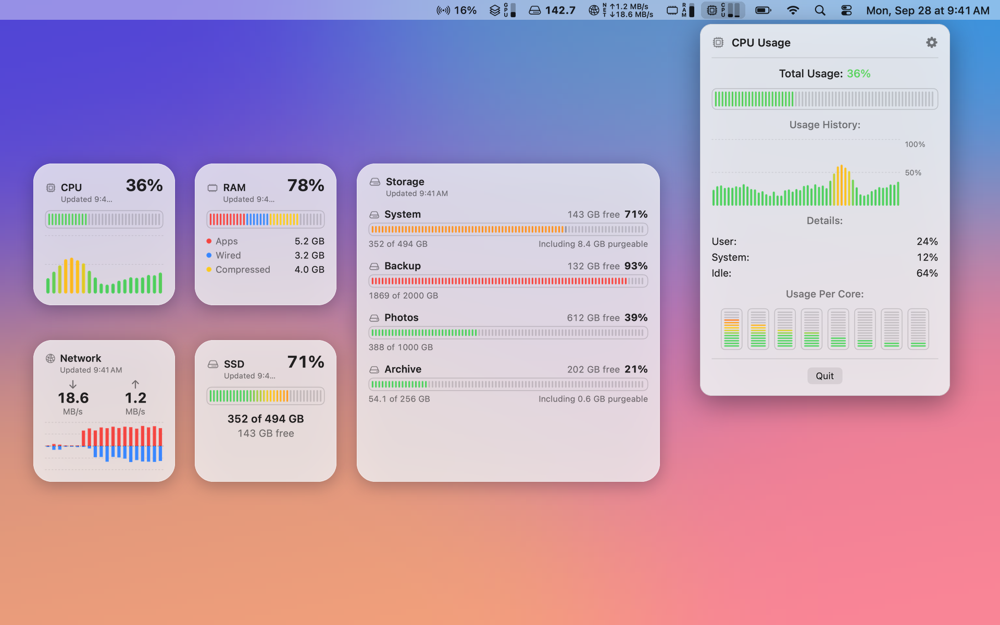
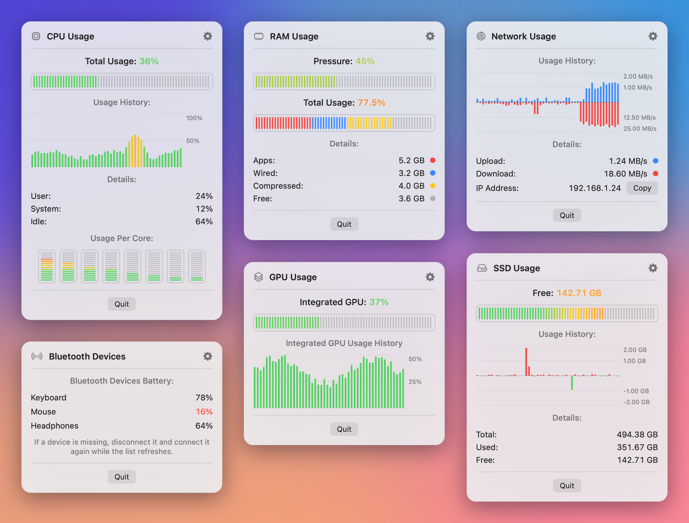
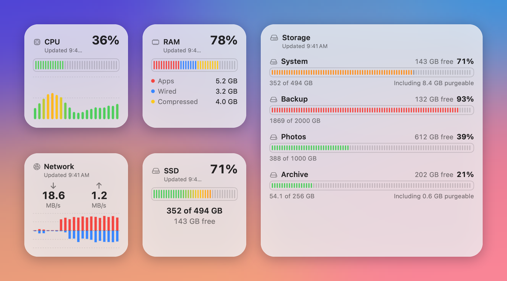

# SimplyBar

**English** | [Français](README.fr.md)

[](https://github.com/Iliesseu28/SimplyBar/actions/workflows/ci.yml)
[](LICENSE)


https://github.com/user-attachments/assets/f5201cb8-1857-4e28-ada7-00c3b93f18bb

See it in action in 29 seconds, with sound.

A free and open source system monitor for the macOS menu bar. SimplyBar shows CPU, memory, network, disk,
GPU and Bluetooth battery levels at a glance, opens a detailed popup when you click an item, and adds five
widgets to your desktop.



## Highlights

- **Free, for good.** No ads, no account, no subscription, no in-app purchase. MIT licensed.
- **Open source.** Every line that runs on your Mac is in this repository.
- **Storage widget for every disk.** One widget lists the startup disk and every external drive, in small,
  medium and large sizes. Pick the disk it shows first in the widget settings.
- **Private by design.** Runs in the App Sandbox with no network access. Nothing is collected, nothing leaves your Mac.
- **Light.** A module you hide is not measured at all. Native Swift and SwiftUI, no third-party dependency.

## What it shows

### Menu bar

Turn each module on or off, and choose what it displays and how (bar, percentage or gigabytes, depending on the module).

| Module | In the menu bar | In its popup |
|---|---|---|
| CPU | Total, user, system, idle, user + system, or one bar per core | Usage history, user, system and idle shares, usage per core |
| RAM | Total, apps, wired, compressed, or memory pressure | Usage history and the full breakdown of used memory |
| GPU | GPU usage | Usage history, titled with the GPU model |
| Network | Upload, download, both, or the local IP address | Upload and download speeds, history, local IP address (one click to copy) |
| SSD | Total, free or used space of the startup disk | History of the space used, then total, used and free space |
| Bluetooth | Battery of your connected devices | Every connected device, with its battery level when macOS reports one |




### Desktop widgets

| Widget | Sizes | Shows |
|---|---|---|
| CPU | Small | CPU usage and its recent history |
| RAM | Small | Memory in use and how it splits: apps, wired, compressed |
| Network | Small | Download and upload speeds with their recent history |
| SSD | Small | Used and free space of the startup disk |
| Storage | Small, medium, large | Every disk, external drives included; the small size shows the disk you pick |

Widgets read the values the app writes to its shared App Group container: keep SimplyBar running for them to
update. WidgetKit refreshes them about every 30 minutes, and a widget you have just added can wait up to
5 minutes for its first numbers. Each widget shows the time of its last reading.



## Known limits

These come from macOS, not from a missing feature:

- **No temperatures and no fan speeds.** The sensors that report them are closed to apps in the App Sandbox,
  which every Mac App Store app must use.
- **No battery level for wireless headphones and earbuds.** macOS does not give it to Mac App Store apps.
  They still appear in the Bluetooth list as connected. Apple keyboards, mice and trackpads, and accessories
  that macOS lists as power sources, do show their battery.
- **Free space is rounded down slightly.** Inside the App Sandbox, macOS rounds the available capacity of a disk.

## Install

- **Mac App Store:** coming soon.
- **From the source code:** see below. The app runs on macOS 14 Sonoma or later (universal build for Apple silicon
  and Intel). Building it takes Xcode 26.6 or later: CI checks every change with Xcode 26.6 and Xcode 27.

## Build and test

Clone the repository, then run the tests from the project folder. Code signing is turned off on the command
line, so no Apple developer account and no certificate are needed:

```sh
git clone https://github.com/Iliesseu28/SimplyBar.git
cd SimplyBar
xcodebuild test \
  -project SimplyBar.xcodeproj \
  -scheme SimplyBar \
  -destination 'platform=macOS' \
  CODE_SIGNING_ALLOWED=NO CODE_SIGNING_REQUIRED=NO CODE_SIGN_IDENTITY=""
```

The run ends with `** TEST SUCCEEDED **`. The same command runs in CI on every push and pull request
([workflow](.github/workflows/ci.yml)).

To compile the app itself in Release, still without signing:

```sh
xcodebuild build \
  -project SimplyBar.xcodeproj \
  -scheme SimplyBar \
  -configuration Release \
  -destination 'platform=macOS' \
  CODE_SIGNING_ALLOWED=NO CODE_SIGNING_REQUIRED=NO CODE_SIGN_IDENTITY=""
```

### Run it on your Mac

The unsigned build proves that the code compiles. To run the app with its widgets, sign it with your own team:

1. Open `SimplyBar.xcodeproj` in Xcode.
2. In **Signing & Capabilities**, choose your team for the `SimplyBar` and `SimplyBarWidgets` targets.
3. The App Group identifier starts with the team ID. Replace `ZNPYGQCK98` with your own team ID in
   `SimplyBar/SimplyBar.entitlements`, `SimplyBarWidgets/SimplyBarWidgets.entitlements` and
   `Shared/SharedStore.swift`. Do not commit this change.
4. Run the `SimplyBar` scheme. The app lives in the menu bar and has no Dock icon.

If the sandboxed app quits right after launch from an external drive, copy `SimplyBar.app` to `/Applications`
and open it from there.

## Architecture

| Folder | Role | Targets |
|---|---|---|
| `Shared/` | Models, number formats, charts, the file shared with the widgets, the String Catalog | App, widgets, tests |
| `Core/` | System readers: CPU (`host_processor_info`), memory (`host_statistics64`), disk (`volumeAvailableCapacityForImportantUsage`), network (`getifaddrs`), GPU (IOKit `IOAccelerator`), Bluetooth (IOKit, power sources, Core Audio), disks of the Storage widget (`getfsstat` and IOKit) | App, tests |
| `SimplyBar/` | The app: settings, sampling timers, menu bar items, popups, settings window | App |
| `SimplyBarWidgets/` | WidgetKit extension. It reads the shared file and measures nothing itself | Widgets |
| `SimplyBarTests/` | Swift Testing suites: formats, percentages, CPU, memory, network and Bluetooth math, real readers | Tests |

- Swift 6 with strict concurrency: views and state on the main actor, readers `nonisolated`.
- No third-party package. Frameworks from the macOS SDK only.
- A module that is neither shown nor open is not measured. A module that only feeds a widget is measured once a minute.
- Texts live in String Catalogs (`Shared/Localizable.xcstrings`, `SimplyBar/InfoPlist.xcstrings`).

## Privacy

- **No data collected.** No analytics, no crash reporter, no account. See
  [the privacy policy](https://simplibot.fr/simplybar/confidentialite).
- **No network access.** The app and its widgets do not have the network entitlement: they cannot connect to
  anything. The network module only counts the bytes of your own interfaces.
- **App Sandbox.** The app and its widgets only share an App Group container on your Mac, used to pass the latest
  values to the widgets. Settings stay in the app's own preferences.
- **Privacy manifests** (`PrivacyInfo.xcprivacy`) declare no tracking and no collected data.

## Links

- Website: <https://simplibot.fr/simplybar>
- Privacy policy: <https://simplibot.fr/simplybar/confidentialite>
- Support: <https://simplibot.fr/simplybar/support>

## Contributing

Bug reports, ideas and pull requests are welcome. Read [CONTRIBUTING.md](CONTRIBUTING.md) first: the App Sandbox,
no network access and no third-party dependency are firm rules. To report a security issue privately, see
[SECURITY.md](SECURITY.md).

## License

SimplyBar is released under the [MIT License](LICENSE). Copyright (c) 2026 Simplibot.
